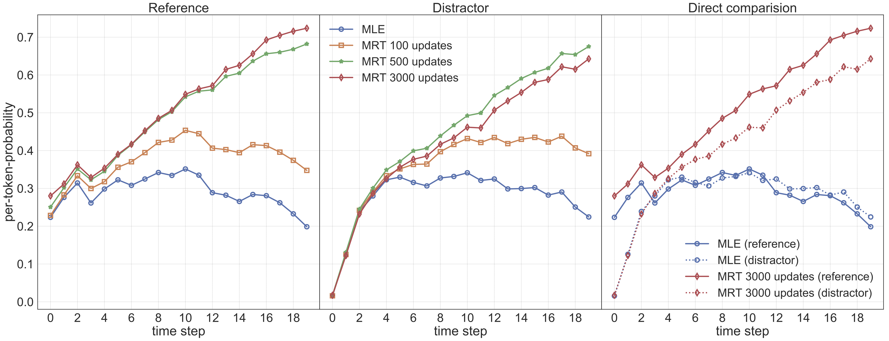

Improve-NMT-Domain-Robustness-with-MRT
-------
Short description and code usage of the project "Minimum Risk Training in Improving Domain Robustness of NMT".

Introduction
------------
Although Neural Machine Translation (NMT) has advanced the state of the art in MT, but is susceptible to domain shift [(Koehn and Knowles, 2017)](https://www.aclweb.org/anthology/W17-3204/). Such translations maybe fluent, but completely unrelated to the input (*hallucinations*), and their misleading nature makes them particularly problematic.

We hypothesise that exposure bias [(Ranzatoet al., 2016)](https://arxiv.org/abs/1511.06732), a discrepancy between training and inference, makes this problem worse. Specifically, training with teacher forcing only exposes the model to gold history, while previous predictions during inference may be erroneous. Thus, an over-reliance on previously predicted words would exacerbate error propagation. 

Previous work has established a link between domain shift and hallucination in NMT ([Koehn and Knowles, 2017](https://www.aclweb.org/anthology/W17-3204/); [M&uuml;ller et al., 2019](https://arxiv.org/abs/1911.03109)). In this project, we empirically establish an link between hallucination and exposure bias. We further empirically confirm the link between exposure bias and the 'beam search problem', i.e. the fact that translation quality does not increase consistently with beam size ([Koehn and Knowles, 2017](https://www.aclweb.org/anthology/W17-3204/); [Ott et al., 2018](https://arxiv.org/abs/1803.00047); [Stahlberg and Byrne, 2019](https://www.aclweb.org/anthology/D19-1331/)).

Minimum Risk Training
---------------------
The de-facto standard training objective in NMT is to minimize the negative log-likelihood  of the training data .

MLE is typically performed teacher forcing, where  are ground-truth labels in training, which creates a mismatch to inference, where  are model predictions. Minimum Riak Training (MRT), however, avoids this problem by defining expected loss with respect to the posterior distribution as the training objective:

in which loss  indicates the discrepency between the gold translation  and the model prediction . 

The posterior distribution  is approximated by a subspace  by sampling a certain number of candidate translations, and normalizing:

where  is a hyperparameter to control the sharpness of the subspace.

Experiments
-----------
- Main results

We execute domain robustness experiments on both German-to-English and German-to-Romansh language pairs, following the data and preprocessing as [M&uuml;ller et al., (2019)](https://arxiv.org/abs/1911.03109).

Results shows that MRT increases average out-of-domain (OOD) BLEU by 0.7-0.8 compared to MLE baselines, which domenstrates the effectiveness of MRT in improving domain robustness of NMT system. MRT does not consistently improve in-domain performance, which is a first indicator that exposure bias maybe more problematic under domain  shift. 

<table class="tg">
  <tr>
    <th class="tg-0pky"></th>
    <th class="tg-7btt" colspan="2">DE-&gt;EN</th>
    <th class="tg-7btt" colspan="2">DE-&gt;RM</th>
  </tr>
  <tr>
    <td class="tg-0pky">system</td>
    <td class="tg-0pky">in-domain</td>
    <td class="tg-0pky">OOD</td>
    <td class="tg-0pky">in-domain</td>
    <td class="tg-0pky">OOD</td>
  </tr>
  <tr>
    <td class="tg-0pky">MLE</td>
    <td class="tg-0pky">58.9</td>
    <td class="tg-0pky">11.2</td>
    <td class="tg-0pky">53.9</td>
    <td class="tg-0pky">18.0</td>
  </tr>
  <tr>
    <td class="tg-0pky">+MRT</td>
    <td class="tg-0pky">58.8</td>
    <td class="tg-fymr">12.0</td>
    <td class="tg-0pky">53.9</td>
    <td class="tg-fymr">18.7</td>
  </tr>
</table>

*Average BLEU and standard deviation on in-domain and out-of-domain test sets for models trained on OPUS (DE→EN) and Allegra (DE→RM).*

- Hallucination analysis

As shown in table below, manual evaluation of hallucination translation (100 samples from each system) indicates that hallucinations are more pronounced in out-of-domain test set (25%) than in in-domain (1%), MRT reduces this by 24% (relative).

<table class="tg">
  <tr>
    <th class="tg-c3ow"></th>
    <th class="tg-c3ow" colspan="2">% hallucinations (BLEU)</th>
  </tr>
  <tr>
    <td class="tg-c3ow">system</td>
    <td class="tg-c3ow">out-of-domain</td>
    <td class="tg-c3ow">in-domain</td>
  </tr>
  <tr>
    <td class="tg-0pky">MLE</td>
    <td class="tg-0pky">25% (11.2)</td>
    <td class="tg-0pky">1% (58.9)</td>
  </tr>
  <tr>
    <td class="tg-0lax">+MRT</td>
    <td class="tg-0lax">19% (12.0)</td>
    <td class="tg-0lax">1% (58.8)</td>
  </tr>
</table>

*Proportion of hallucinations and BLEU on out-of-domain and in-domain test sets. DE→EN OPUS*

- Uncertainty Analysis

We further investigate the posterior distribution of NMT model by visualizing model's per-token probability assigned to each token of (1) a random sampled target sentence in the training set, , (2) the reference target sentence, , given source sentence,  in the test sets.

We compute the average value over all of four out-of-domain test sets and visualize in Figure below.

*Per-token probability of out-of-domain reference translations and in-domain distractors. Rightmost plot shows direct comparison for MLE baseline and final MRT model. DE→EN OPUS*

In the figure, *distracctor* denotes the random smapled sentences and *reference* represents ground-truth translation. The left two graphs show probabilities for references and distractors, respectively. The right-most graph shows a direct comparison of probabilities for references and distractors for the MLE baseline and the final MRT model. The MLE baseline assigns similar probabilities to tokens in the references and the distractors. Only for the first time steps is there a clear preference for the references over the (mostly random!) distractors. This shows that error propagation is a big risk: should the model make a wrong prediction initially, this is unlikely to be penalized in later time steps. 

MRT tends to increase the model’s certainty at later time steps (the uncertainty of the baseline is due to label smoothing), but importantly, the increase is sharper for the reference translations than for the distractors. The direct comparison shows a widening gap in certainty between the reference and distractor sentences. In other words, producing a hallucination will incur a small penalty at each timestep (compared to the reference), presumably due to a higher reliance on the source signal, lessening the risk of error propagation and hallucinations. 

- Beam size analysis

Based on error proporation observed above, we suspect that beam size problem would be related to exposure bias (and corresponding error propagation). Then, MRT would mitigate the problem. We evaluate BLEU score and hallucinations with beam sizes of 1,4 and 50 over two models. 

<table class="tg">
  <tr>
    <th class="tg-c3ow"></th>
    <th class="tg-c3ow" colspan="3">BLEU (% hallucinations)</th>
  </tr>
  <tr>
    <td class="tg-c3ow">system</td>
    <td class="tg-c3ow">k=1</td>
    <td class="tg-c3ow">k=4</td>
    <td class="tg-baqh">k=50</td>
  </tr>
  <tr>
    <td class="tg-c3ow">MLE</td>
    <td class="tg-0pky">10.6 (27%)</td>
    <td class="tg-0pky">11.2 (25%)</td>
    <td class="tg-0lax">9.4 (39%)</td>
  </tr>
  <tr>
    <td class="tg-baqh">+MRT</td>
    <td class="tg-0lax">11.3 (20%)</td>
    <td class="tg-0lax">12.0 (19%)</td>
    <td class="tg-0lax">10.9 (24%)</td>
  </tr>
</table>

*Average OOD BLEU and proportion of hallucinations with different beam sizes k. DE→EN OPUS*

While MRT does not eliminate the beam search problem, performance drops less steeply as beam size increases. With beam size 4, our MRT models outperform the MLE baseline by 0.8 BLEU; with beam size 50, this difference grows to 1.5 BLEU. Our manual evaluation shows that the number of hallucinations increases for large beams, and that MRT mitigates this problem, slowing the rise in the proportion of hallucinations (38% relative reduction for beam size 50).

Overall, the experiments provide us an insight that our standard MLE training strategy would model a poor posterior distribution in some scenarios. MRT would refine the posterior distribution. Hallucination and beam search problem are just exposed problems from this ultimate source.

Usage instruction
-----------------
The code is modified based on [Nematus](https://github.com/EdinburghNLP/nematus). 

*Only respository-specific usage instruction, for general usages instruction, please refer to [Nematus](https://github.com/EdinburghNLP/nematus)*

requires the following packages:

 - Python 3 (tested on version 3.5.2)
 - TensorFlow (tested on version 1.12)

#### `nematus/train.py` : use to train a new model

#### training parameters
| parameter | description |
|---        |---          |
| --loss_function {cross-entropy,per-token-cross-entropy, MRT} | loss function. MRT: Minimum Risk Training https://www.aclweb.org/anthology/P/P16/P16-1159.pdf) (default: cross-entropy) |
| --print_per_token_pro PATH | PATH to store the probability of each target token given source sentences over the training dataset (without training). If set to False, the function will not be triggered. (default: False). Please get rid of the 1.0s at the end of each list which are the probability of padding. |

#### minimum risk training parameters (MRT)

| parameter | description |
|---        |---          |
| --mrt_reference | add reference into MRT candidates sentences (default: False) |
| --mrt_alpha FLOAT | MRT alpha to control the sharpness of the distribution of sampled subspace (default: 0.005) |
| --samplesN INT | the number of sampled candidates sentences per source sentence (default: 100) |
| --mrt_loss | evaluation metrics used to compute loss between the candidate translation and reference translation (default: SENTENCEBLEU n=4) |
| --mrt_ml_mix FLOAT | mix in MLE objective in MRT training with this scaling factor (default: 0) |
| --sample_way {beam_search, randomly_sample} | the sampling strategy to generate candidates sentences (default: beam_search) |
| --max_len_a INT | generate candidates sentences with maximum length: ax + b, where x is the length of the source sentence (default: 1.5) |
| --max_len_b INT | generate candidates sentences with maximum length: ax + b, where x is the length of the source sentence (default: 5) |
| --max_sentences_of_sampling INT | maximum number of source sentences to generate candidates sentences at one time (limited by device memory capacity) (default: 0) |

Data dowload and preprocessing, please refer to https://github.com/ZurichNLP/domain-robustness

Please refer to https://github.com/EdinburghNLP/wmt17-transformer-scripts for training and evaluation process, the default training scripts of our experiments are [here](./scripts).

